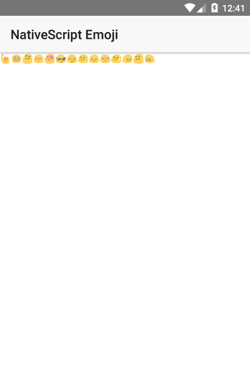

# NativeScript Emoji

Emojis for NativeScript



## Instalation
`tns plugin add nativescript-emoji`

## Usage
###### XML

```
<Page xmlns="http://schemas.nativescript.org/tns.xsd" xmlns:Emoji="nativescript-emoji" navigatingTo="navigatingTo" class="page">
  
    <Page.actionBar>
        <ActionBar title="NativeScript Emoji" icon="" class="action-bar">
        </ActionBar>
    </Page.actionBar>
    <StackLayout orientation="horizontal">
        <Emoji:Emoji icon="128587" /> 
    </StackLayout>
</Page>
```

###### TS
```
import { Emoji } from 'nativescript-emoji';
```

###### ANGULAR
```
registerElement("Emoji", () => require("nativescript-emoji").Emoji);
```

## IMPORTANT
To use emoji, you need to set a valid unicode decimal value. To see the full list of emojis, click on the link below.

| Emoji | Decimal Unicode |
|:-----:|:---------------:|
|   😁  |      128513     |
|   😂  |      128514     |
| 😃    |      128515     |
|   More Emojis:     |      http://apps.timwhitlock.info/emoji/tables/unicode     |

##### iOS
The iOS support is under development

