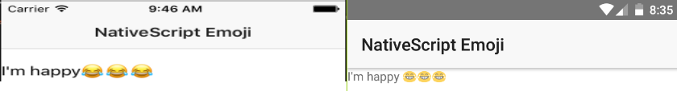

[](https://www.npmjs.com/package/nativescript-emoji)
[](https://www.npmjs.com/package/nativescript-emoji)

# NativeScript Emoji   😀😊🚀 

A simple library to add Emoji support to your NativeScript app. Working on Android and iOS



## Instalation
`tns plugin add nativescript-emoji`

## Usage
###### XML 
```
<Page xmlns="http://schemas.nativescript.org/tns.xsd" xmlns:Emoji="nativescript-emoji" navigatingTo="navigatingTo" class="page">  
    <Page.actionBar>
        <ActionBar title="NativeScript Emoji" icon="" class="action-bar">
        </ActionBar>
    </Page.actionBar>
    <StackLayout orientation="horizontal">
        <Label text="I'm happy "> </Label>
        <Emoji:Emoji name="joy" />
        <Emoji:Emoji name="joy" />
        <Emoji:Emoji name="joy" />
    </StackLayout>
</Page>
```

###### TS
```
import { Emoji } from 'nativescript-emoji';
```

###### ANGULAR
```
import { registerElement } from "nativescript-angular/element-registry";

registerElement("Emoji", () => require("nativescript-emoji").Emoji);
```

## How to use
Set emoji property name with the short-name of the emoji.

`<Emoji:Emoji name="joy" />`

### Available Properties

`name`: emoji short-name

`size`: size to display emoji

The full list you can access on the link below.
https://raw.githubusercontent.com/dzfweb/nativescript-emoji/master/emoji.database.ts


